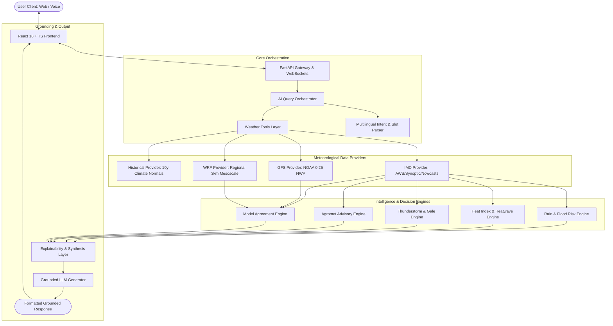

# Architectural System Diagram

```mermaid
graph TD
    User([User Client: Web / Voice]) <--> UI[React 18 + TS Frontend]
    UI <--> API[FastAPI Gateway & WebSockets]
    
    subgraph "Core Orchestration"
        API --> Orchestrator[AI Query Orchestrator]
        Orchestrator --> IntentParser[Multilingual Intent & Slot Parser]
        Orchestrator --> Tools[Weather Tools Layer]
    end

    subgraph "Meteorological Data Providers"
        Tools --> IMD[IMD Provider: AWS/Synoptic/Nowcasts]
        Tools --> GFS[GFS Provider: NOAA 0.25 NWP]
        Tools --> WRF[WRF Provider: Regional 3km Mesoscale]
        Tools --> Hist[Historical Provider: 10y Climate Normals]
    end

    subgraph "Intelligence & Decision Engines"
        IMD --> RainRisk[Rain & Flood Risk Engine]
        IMD --> HeatRisk[Heat Index & Heatwave Engine]
        IMD --> StormRisk[Thunderstorm & Gale Engine]
        IMD --> Agri[Agromet Advisory Engine]
        GFS & WRF & IMD --> Fusion[Model Agreement Engine]
    end

    subgraph "Grounding & Output"
        RainRisk & HeatRisk & StormRisk & Agri & Fusion --> Synthesis[Explainability & Synthesis Layer]
        Synthesis --> GroundedLLM[Grounded LLM Generator]
        GroundedLLM --> Response([Formatted Grounded Response])
        Response --> UI
    end
```
