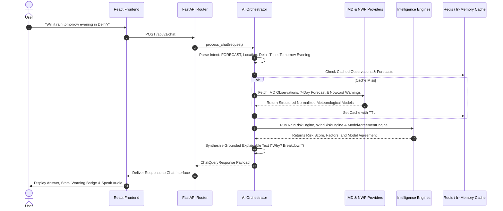

# End-to-End Meteorological Data Flow

```mermaid
sequenceDiagram
    autonumber
    actor User
    participant UI as React Frontend
    participant API as FastAPI Router
    participant AI as AI Orchestrator
    participant Provider as IMD & NWP Providers
    participant Engine as Intelligence Engines
    participant Cache as Redis / In-Memory Cache

    User->>UI: "Will it rain tomorrow evening in Delhi?"
    UI->>API: POST /api/v1/chat
    API->>AI: process_chat(request)
    AI->>AI: Parse Intent: FORECAST, Location: Delhi, Time: Tomorrow Evening
    AI->>Cache: Check Cached Observations & Forecasts
    alt Cache Miss
        AI->>Provider: Fetch IMD Observations, 7-Day Forecast & Nowcast Warnings
        Provider-->>AI: Return Structured Normalized Meteorological Models
        AI->>Cache: Set Cache with TTL
    end
    AI->>Engine: Run RainRiskEngine, WindRiskEngine & ModelAgreementEngine
    Engine-->>AI: Returns Risk Score, Factors, and Model Agreement
    AI->>AI: Synthesize Grounded Explainable Text ("Why? Breakdown")
    AI-->>API: ChatQueryResponse Payload
    API-->>UI: Deliver Response to Chat Interface
    UI->>User: Display Answer, Stats, Warning Badge & Speak Audio
```
