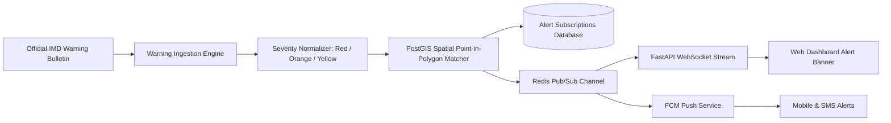

# Severe Weather Alert & Disaster Warning Flow

## Severity Tiers

1. **RED (Warning)**: Take Immediate Action. Severe cyclones, intense thunderstorm downpours (>150 mm), catastrophic winds (>65 km/h).
2. **ORANGE (Alert)**: Be Prepared. Squally winds (40-60 km/h), heavy rains (65-115 mm), localized flooding.
3. **YELLOW (Watch)**: Be Updated. Advisory conditions; keep track of meteorological developments.
4. **GREEN (No Warning)**: Safe meteorological baseline.
